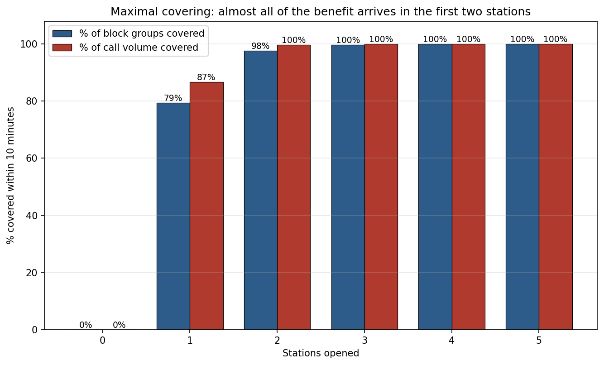

# Where to put the ambulances

Siting EMS stations in Pittsburgh with integer programming, on 635,235 real 911
dispatches.

The question a city actually asks is not "where is the single best station" but
"how many do we need, and who is left waiting". This repository answers both,
using two classical facility-location models over ten years of Allegheny County
dispatch records, and then checks the answer against the assumptions it rests
on, because most of them turn out to matter more than the model does.

---

## Headline results

| | Set cover | Maximal covering (p = 3) |
|---|---|---|
| Stations | **4** | **3** |
| Block groups covered within 10 min | 389 / 389 (100%) | 388 / 389 (99.7%) |
| Call volume covered within 10 min | 100% | **99.9998%** |
| Mean response time | 4.46 min | 5.22 min |
| Call-weighted mean response | 4.13 min | 4.98 min |
| Worst-case response | 9.94 min | 10.04 min |
| Solve time | 0.03 s | 0.05 s |

**The fourth station buys one block group, and that block group generated one
call in ten years.** Set cover insists on covering every demand point, so it
pays for a station to reach the single hardest one. Drop that constraint and a
three-station system still reaches 99.9998% of actual call volume. The entire
difference between a four-station answer and a three-station answer is a
rounding error in demand terms, and it is invisible unless you weight demand
points by how much demand they generate.

That is the result worth taking away: **on this instance the choice of
objective matters far more than the choice of solver, and the constraint "cover
every point" quietly means "cover the emptiest point".**

---

## The models

Both run over the same binary coverage matrix `a_ij`, which is 1 when a station
at candidate `j` reaches demand point `i` inside the response-time threshold.
All 389 block groups are simultaneously demand points and candidate sites, so
the matrix is 389 x 389 with density 0.530.

**Set cover.** The cheapest fleet that leaves nobody outside the standard.

```
min   sum_j y_j
s.t.  sum_j a_ij y_j >= 1     for every demand point i
      y_j in {0,1}
```

**Maximal covering (MCLP).** Given a budget of exactly `p` stations, reach as
much as possible.

```
max   sum_i v_i z_i
s.t.  sum_j y_j = p
      z_i <= sum_j a_ij y_j   for every demand point i
      y_j, z_i in {0,1}
```

`v_i` is where the interesting choice hides. With `v_i = 1` the model maximises
the *count of block groups* covered and treats a block group generating 200
calls exactly like one generating 14,481. With `v_i = call_count_i` it maximises
*covered call volume*. Both are implemented and both are reported, because
which one you pick is a policy statement, not a technicality.

### How hard is the instance, really

| Threshold | Stations | LP bound | Integrality gap | Solve time |
|---|---|---|---|---|
| 5 min | 10 | 9.12 | 0.88 | 0.01 s |
| 7 min | 6 | 6.00 | 0.00 | 0.02 s |
| 8 min | 4 | 4.00 | 0.00 | 0.02 s |
| **10 min** | **4** | **3.50** | **0.50** | 0.02 s |
| 15 min | 2 | 2.00 | 0.00 | 0.01 s |

Set cover is NP-hard in general, and this instance is not. Gurobi's presolve
removes every row and column at the 10-minute threshold and the model is gone
before branch and bound starts. The LP relaxation is integral at most
thresholds and the largest gap anywhere is 0.88. Reporting this is the honest
alternative to implying that a hard combinatorial problem was conquered: the
geometry of a compact city with 389 candidate sites and a generous radius is
simply easy.

---

## What the answer actually depends on

Three assumptions move the result more than the optimisation does.

**Speed, which sets the coverage radius.** Travel time is straight-line
distance at a constant assumed speed. Vary that one constant and the
recommendation changes by two stations:

| Assumed speed | 10-min reach | Stations needed |
|---|---|---|
| 30 km/h | 5.0 km | 5 |
| 35 km/h | 5.8 km | 4 |
| **40 km/h** | **6.7 km** | **4** |
| 45 km/h | 7.5 km | 3 |
| 50 km/h | 8.3 km | 3 |

Pittsburgh sits at the confluence of three rivers. Straight-line distance
understates real driving distance wherever a bridge or a hillside is in the
way, so every response time here is optimistic and 40 km/h is doing a lot of
quiet work. Swapping in road-network routing is a one-line change (any
`(lat1, lon1, lat2, lon2) -> minutes` callable can be passed to
`build_time_matrix`), and it is the single highest-value extension.

The choice between great-circle and flat-earth distance, by contrast, is
irrelevant here: the two disagree by at most **0.056 minutes** across the whole
389 x 389 matrix.

**Where the threshold sits.** Eight, nine and ten minutes all cost four
stations. The cost only starts climbing below eight, and reaching a five-minute
standard needs ten stations. A city debating "10 minutes versus 9" is debating
nothing; a city debating "8 versus 6" is debating a doubling of capital cost.


**Which demand points are even visible.** See the data section below.

---

## Coverage against budget



| Stations | % block groups covered | % call volume covered | Same sites under both objectives |
|---|---|---|---|
| 1 | 79.4% | 86.6% | no |
| 2 | 97.7% | 99.7% | yes |
| 3 | 99.7% | 99.9998% | yes |
| 4 | 100% | 100% | yes |

Returns collapse almost immediately: two stations reach 99.69% of call volume.
The two objectives disagree only at `p = 1`, where maximising blocks and
maximising calls pick different sites, and even there the call-volume
difference is 0.1 points. On a more spread-out service area the divergence
would be much larger, which is exactly why it is worth measuring rather than
assuming.

---

## Equity

The objective is blind to demographics by construction. Nothing in either model
knows the racial composition of a block group. Any disparity below is therefore
a consequence of where demand and geography put the stations.


Call-weighted mean response time, in minutes:

| Block group majority | Block groups | Calls | Set cover | MCLP |
|---|---|---|---|---|
| Majority White | 273 | 422,300 | **3.89** | 5.38 |
| Majority Black | 72 | 142,006 | 4.84 | **3.93** |
| Majority Asian | 1 | 839 | 4.74 | 4.29 |
| Other or mixed | 33 | 48,408 | 3.81 | 4.88 |
| Spread, best to worst | | | 1.04 min | 1.46 min |

**The two models trade the disparity in opposite directions.** Under set cover,
majority-Black block groups wait 0.95 minutes longer than majority-White ones.
Under MCLP the ordering inverts: majority-Black block groups are the
best-served group and majority-White ones the worst. Neither model was told to
care. The reversal happens because MCLP concentrates its three stations near
the dense, high-call-rate core, which is disproportionately Black, while set
cover spends its fourth station reaching the sparse periphery, which is
disproportionately White.

The share of calls reached within a tighter five-minute benchmark tells the
same story more sharply: set cover reaches 70.4% of majority-White calls but
58.6% of majority-Black calls, while MCLP reaches 42.8% and 61.8%.

Two honest caveats. The majority-Asian row is a single block group and should
not be read as a statement about a population. And per-capita call rates differ
enormously across groups (majority-Black block groups generate about 2,100
calls per 1,000 residents against 1,400 for majority-White), so response-time
equity and per-capita-burden equity are different questions and this analysis
only addresses the first.

---

## The data problem worth knowing about


The dispatch records span 2015 to 2024 and carry GEOIDs geocoded against **2010**
census block groups. The TIGER shapefile and the Social Explorer extract are
both **2020** vintage. Joining them on the GEOID string, which is the obvious
thing to do, matches only 302 of 389 block groups. The 87 that fail to match
carry **26.4% of all calls**, and they fail silently: the join simply produces
nulls, the nulls get labelled "unknown", and the equity analysis runs on three
quarters of the demand without anything going visibly wrong.

The fix is to join on geography rather than on strings. `crosswalk_to_2020`
locates each 2010 centroid inside whichever 2020 block group actually contains
it, which resolves all 389 points and takes demographic coverage from 73.6% of
calls to 100%. The 389 demand points collapse onto 332 distinct 2020 block
groups, since the 2020 redraw merged some neighbours.

This changes the equity numbers materially, and it is the reason they are worth
reporting at all.

Other things the data says: demand is uneven but not hotspot-dominated (Gini
0.49, busiest 10% of block groups carry 36% of calls), serious calls (E0-E2)
outnumber routine ones roughly three to one and have grown about 15% since
2015, and 2020 is a visible dip in both.

---

## Interactive maps

Two self-contained HTML maps, about 3 MB each, with layered choropleths for
response time, call volume, calls per capita, population, and racial
composition, plus station markers and their coverage radii.

- [`results/maps/set_cover_solution.html`](results/maps/set_cover_solution.html)
- [`results/maps/mclp_solution.html`](results/maps/mclp_solution.html)

Download and open in a browser, or view through
[nbviewer](https://nbviewer.org/) / [raw.githack.com](https://raw.githack.com/).

An earlier version of these maps was 24 MB and 16 MB, because tooltips were
added by creating one `folium.GeoJson` object per block group, which
re-serialises the polygon geometry once per block group per layer. Passing the
whole layer to a single `GeoJson` with a `GeoJsonTooltip`, and simplifying the
polygons at a 2 m tolerance (0.0015% total area change), gives the same
interaction at an eighth of the size.

---

## Running it

```bash
pip install -r requirements.txt
```

`gurobipy` from pip ships a size-limited licence that is comfortably larger
than these models need (778 variables at most).

The raw dispatch extract is 372 MB and is not in the repository. Download it
from the [Allegheny County 911 dispatches dataset](https://catalog.data.gov/dataset/allegheny-county-911-dispatches-ems-and-fire)
into `data/raw/`, and the [2020 TIGER block group shapefile for Pennsylvania](https://www2.census.gov/geo/tiger/TIGER2020/BG/tl_2020_42_bg.zip)
into `data/geo/`. Then:

```bash
python -m src.data_prep
```

```bash
python -m src.run_analysis
```

`data_prep` takes a couple of minutes, `run_analysis` about thirty seconds. The
derived tables in `data/processed/` are committed, so `run_analysis` works
without the raw download if you only want to reproduce the results.

```bash
pytest tests/
```

---

## Layout

```
src/
  data_prep.py      raw extract -> demand points, demand panel, demographics, geometry
  coverage.py       travel-time functions and the binary coverage matrix
  models.py         set cover, MCLP, LP relaxation, nearest-station assignment
  equity.py         response-time distributions by demographic group
  mapping.py        Folium maps
  run_analysis.py   solves everything, writes every table and figure
tests/              coverage-matrix and model invariants
data/processed/     committed derived tables
results/            tables, figures, maps
```

Every number in this README comes from `python -m src.run_analysis`.

## Data sources

- [Allegheny County 911 Dispatches, EMS and Fire](https://catalog.data.gov/dataset/allegheny-county-911-dispatches-ems-and-fire), 2015 to 2024
- [Social Explorer](https://www.socialexplorer.com/), ACS population, race and housing by block group
- [US Census TIGER/Line 2020](https://www.census.gov/geographies/mapping-files/time-series/geo/tiger-line-file.html) block group boundaries

## Licence

MIT, see [LICENSE](LICENSE).
