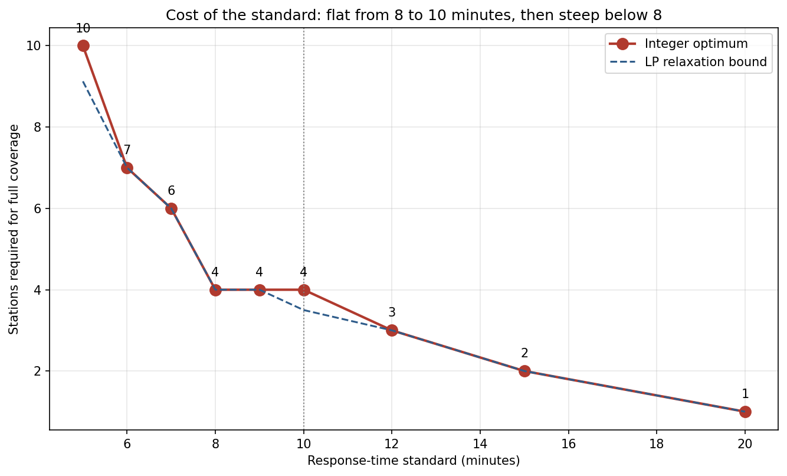
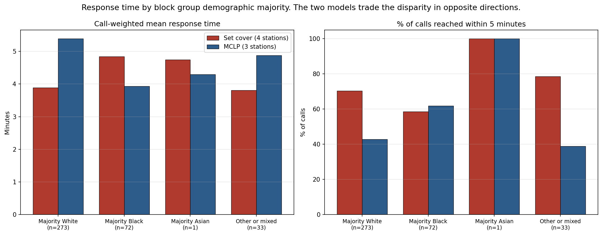
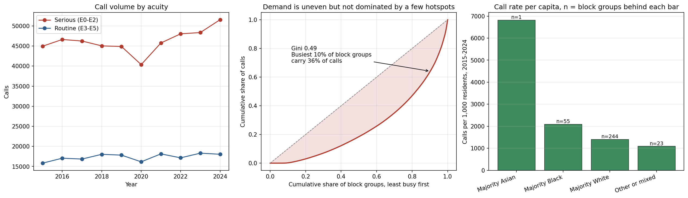

# Where should Pittsburgh put its ambulance stations?

A course project in operations research. The question is simple to state and
harder to answer: if you are placing ambulance stations in a city, how many do
you need, where do they go, and who ends up waiting longest?

I used ten years of real 911 dispatch records for the City of Pittsburgh and
two classic facility location models to work it out.

---

## The setup

The city is split into 389 census block groups. Each one is:

- a **demand point**, because people there call 911, and
- a **candidate site**, because a station could be built there.

For every pair of block groups I compute a travel time, then decide whether a
station in one could reach the other inside a target response time. The default
target is 10 minutes. That gives a big table of yes/no answers called a
**coverage matrix**, and both models are just different questions asked about
that table.

The data is 635,235 EMS dispatches from 2015 to 2024.

---

## The two models

### Set cover: "leave nobody out"

Find the smallest number of stations such that **every** block group is within
10 minutes of at least one of them.

```
minimise   (number of stations opened)
subject to every block group has at least one station that can reach it
```

Each station is a yes/no decision, which makes this an **integer program**. I
solved it with Gurobi.

**Answer: 4 stations.**

### Maximal covering: "you only have a budget for p"

Cities rarely get to build however many stations the math wants. So the second
model fixes the number of stations at `p` and asks how much of the city you can
reach with them.

```
maximise   (amount of demand covered)
subject to exactly p stations are opened
```

**Answer with 3 stations: 388 of 389 block groups covered.**

---

## The main finding

Set cover says 4 stations, maximal covering says 3 stations gets you almost
everything. So what does the fourth station actually buy?

**One block group. And that block group made one 911 call in ten years.**

Three stations reach 99.9998% of the actual call volume. Set cover insists on
covering every point on the map, so it pays for a whole extra station to reach
the single most awkward one, even though essentially nobody lives there.

This is the real lesson of the project: the constraint "cover everyone" sounds
obviously correct, but in practice it means "cover the emptiest place," and it
can cost you 25% of your budget. How you phrase the objective matters more than
which solver you use.

| | Set cover | Maximal covering (p = 3) |
|---|---|---|
| Stations | 4 | 3 |
| Block groups covered | 389 / 389 | 388 / 389 |
| Share of calls covered | 100% | 99.9998% |
| Average response time | 4.46 min | 5.22 min |
| Average per call | 4.13 min | 4.98 min |
| Worst case | 9.94 min | 10.04 min |

---

## How much does the answer depend on the assumptions?

Quite a lot, and this was worth checking rather than assuming.

**The assumed driving speed.** Travel time is straight-line distance divided by
an assumed speed of 40 km/h. Change that one number and the recommendation
changes by two stations:

| Speed | Stations needed |
|---|---|
| 30 km/h | 5 |
| 40 km/h | 4 |
| 50 km/h | 3 |

Pittsburgh sits where three rivers meet, so straight-line distance understates
real driving distance whenever a bridge or a hill is in the way. Every response
time here is therefore optimistic. Swapping in real road-network routing would
be the single most useful improvement.

**The response time target.**

| Target | Stations |
|---|---|
| 5 min | 10 |
| 7 min | 6 |
| 8 min | 4 |
| 10 min | 4 |
| 15 min | 2 |

Eight, nine and ten minutes all cost four stations, so arguing about "10 versus
9" changes nothing. The cost only starts climbing below eight minutes.



**Was this a hard problem?** Not really, and it is worth being honest about
that. Set cover is famously hard in general, but this particular instance is
easy: Gurobi's presolve eliminates the whole model before the real search
begins, and it finishes in about 0.03 seconds. A compact city with 389
candidate sites and a generous 10 minute radius is just not a difficult case.

---

## Fairness

Neither model knows anything about who lives where. Race, income and population
appear nowhere in the objective. So any difference in response times between
neighbourhoods is a side effect of geography and demand, not something the
model was told to produce.

I still checked, because "the model wasn't told to discriminate" is not the same
as "the outcome is even."

Average response time per call, in minutes:

| Neighbourhood majority | Set cover | Maximal covering |
|---|---|---|
| Majority White | 3.89 | 5.38 |
| Majority Black | 4.84 | 3.93 |
| Gap between best and worst | 1.04 | 1.46 |

**The two models tilt the gap in opposite directions.** Under set cover,
majority-Black block groups wait about a minute longer. Under maximal covering
that flips, and they become the best served group.

The reason is straightforward once you see where the stations go. Maximal
covering concentrates its three stations near the dense, high-call-volume core
of the city, which is disproportionately Black. Set cover spends its fourth
station reaching the thinly populated edges, which are disproportionately White.



Two caveats I want to be upfront about. The "majority Asian" category in the
full results is a single block group, so it should not be read as a statement
about a population. And this only measures response time, not who needs an
ambulance most often, which is a separate question.

---

## A data problem that changed the answer

This turned out to be the most instructive part of the project.

The dispatch records label each call with a census block group ID from the
**2010** census. The map file and the demographic data both use **2020** IDs.
Between those two censuses, some block groups were redrawn and renumbered.

If you join the two datasets by matching ID strings, which is the obvious thing
to do, 87 of the 389 block groups silently fail to match. They do not throw an
error. They just come back empty and get quietly labelled "unknown."

Those 87 block groups contain **26.4% of all the calls.**

The fix is to match on geography instead of on text: take each block group's
centre point and find which 2020 block group physically contains it. That
matches all 389, and takes demographic coverage from 73.6% of calls to 100%.

This materially changed the fairness numbers above, which is why they are worth
reporting at all. It is a good reminder that a join can fail silently and still
give you a plausible looking answer.



Other things worth noting from the data: demand is uneven but not dominated by a
few hotspots (the busiest 10% of block groups account for 36% of calls), serious
calls outnumber routine ones roughly three to one, and there is a visible dip in
2020.

---

## Interactive maps

Two self-contained HTML maps with switchable layers for response time, call
volume, calls per person, population and demographics, plus the station
locations and their coverage radii.

- [`results/maps/set_cover_solution.html`](results/maps/set_cover_solution.html)
- [`results/maps/mclp_solution.html`](results/maps/mclp_solution.html)

Download and open in a browser.

---

## Running it

```bash
pip install -r requirements.txt
```

The raw dispatch file is 372 MB and is not stored here. Download it from the
[Allegheny County 911 dispatch dataset](https://catalog.data.gov/dataset/allegheny-county-911-dispatches-ems-and-fire)
into `data/raw/`, and the
[2020 census block group shapefile for Pennsylvania](https://www2.census.gov/geo/tiger/TIGER2020/BG/tl_2020_42_bg.zip)
into `data/geo/`. Then:

```bash
python -m src.data_prep
```

```bash
python -m src.run_analysis
```

The processed data files are included in the repo, so if you only want to
reproduce the results you can skip the download and run the second command.

```bash
pytest tests/
```

22 tests covering the distance calculations and the two models.

---

## What is in here

```
src/
  data_prep.py      cleans the raw data and fixes the 2010/2020 mismatch
  coverage.py       travel times and the coverage matrix
  models.py         set cover and maximal covering, solved with Gurobi
  equity.py         response times broken down by neighbourhood
  mapping.py        the interactive maps
  run_analysis.py   runs everything and writes all results
notebooks/
  facility_location_walkthrough.ipynb    step by step version
results/            tables, figures and maps
```

Every number quoted above comes from `python -m src.run_analysis`.

## Data sources

- [Allegheny County 911 Dispatches, EMS and Fire](https://catalog.data.gov/dataset/allegheny-county-911-dispatches-ems-and-fire), 2015 to 2024
- [Social Explorer](https://www.socialexplorer.com/), census population and housing data
- [US Census TIGER/Line 2020](https://www.census.gov/geographies/mapping-files/time-series/geo/tiger-line-file.html) block group boundaries

## Licence

MIT, see [LICENSE](LICENSE).
